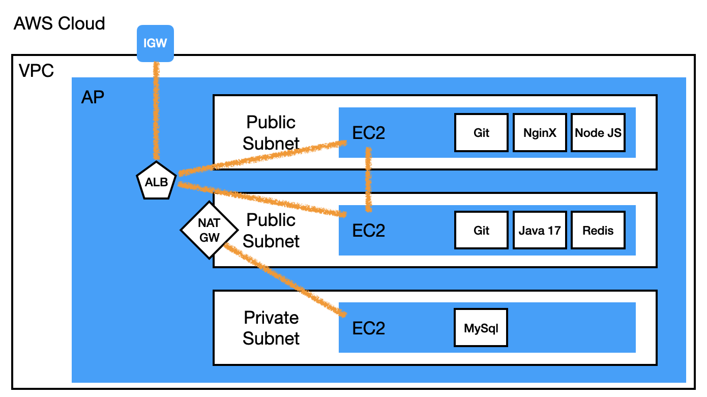

# 서비스 구성
## 1. 스펙 및 적용 기술
- java 17
- spring boot 3
- jpa
- mysql
- redis
- spring security
- oauth2 login (google)
- jwt
- github-actions (CICD)
- aws

## 2.  기능 정리
### 1) 회원
- 회원 가입
- 점수 및 랭크 퍼센트 조회
- 회원 하트 차감 및 추가
### 2) 관리자
- 회원 목록 조회 및 회원 검색
- 퀴즈 목록 조회 및 퀴즈 검색
- 퀴즈 생성 수정 삭제
### 3) 퀴즈
- 문제 조회
- 문제 풀이
- 문제 풀이 시도 횟수 차감 및 초기화

# 💻 AWS 서버 구성

